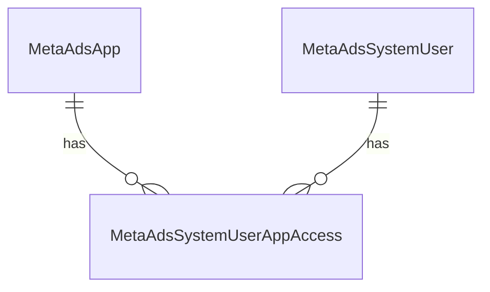

# Contexto Meta Ads API — Fersua Analytics (FSA)

Documento alineado al proyecto **Dashboard Fersua** (`back/` + `front/`). Objetivo: traer métricas de Meta sin depender solo del Excel/CSV manual, integrando una **3ª opción** en **Campañas Meta** que alimenta el **mismo modelo** que el import actual.

---

## Objetivo

1. **Fase 1 (actual):** En **Marketing → Campañas Meta**, opción **API Meta** para consultar el **día anterior**, vista previa e importación al modelo existente (depuración vs Excel).
2. **Fase 2 (pendiente):** Job diario automático cuando los datos coincidan razonablemente con Ads Manager.

---

## Configuración en Meta (ya hecha)

- Negocio: **FersuaStore**
- App: **FersuaStore Reportes**
- Caso de uso: *Crear y administrar anuncios con la API de marketing*
- Usuario del sistema: **API Reportes**
- Permiso: `ads_read`
- Cuentas asignadas al usuario del sistema (lectura/rendimiento)
- Token probado en Graph API Explorer con `/insights`

---

## Variables de entorno (`back/.env`)

```env
API_Reportes_token=...
META_API_VERSION=v25.0
META_TIMEZONE=America/Bogota
```

**No usar en `.env`:**
- `META_AD_ACCOUNT_IDS` — las cuentas están en BD (`cuentas_publicitarias`)
- `META_REPORT_LOOKBACK_DAYS` — fase 1 fija en **ayer**

**Reglas:**
- No hardcodear ni loguear el token
- No subir `.env` al repositorio
- En Graph API el ID de cuenta va con prefijo `act_` (`act_${metaAccountId}`); en BD se guarda sin prefijo (ej. `1471976967613858`)

---

## Módulos de la aplicación

| Función | Módulo UI | Backend |
|--------|-----------|---------|
| Registrar cuentas Meta | **Marketing → Cuentas publicitarias** | `GET/POST /api/meta-campaign/advertising-accounts` |
| Catálogo de apps Meta | **Configuración → Apps Meta** (ADMIN) | `/api/admin/meta-ads-apps` |
| Usuarios del sistema + tokens por app | **Configuración → Usuarios Meta Ads** (ADMIN) | `/api/admin/meta-ads-system-users` |
| Importar métricas (archivo o API) | **Marketing → Campañas Meta** | `.../advertising-campaigns/import/*` |
| Gasto publicitario dashboard | **Dashboard → Finanzas** | `metaCampaignSpend.ts` → `advertising_campaign_metrics` |

---

## Modelo de datos (existente — no crear `meta_ads_daily_insights` en fase 1)

### Tres tablas Meta Ads (global, solo ADMIN)



**`meta_ads_apps` → `MetaAdsApp`**
- `name`, `metaAppId` (opcional), `notes`, `isActive`

**`meta_ads_system_users` → `MetaAdsSystemUser`**
- `name`, `metaSystemUserId`, `notes`, `isActive` (sin token ni app en esta fila)

**`meta_ads_system_user_app_access` → `MetaAdsSystemUserAppAccess`**
- Par usuario + app con `accessToken` (no se devuelve completo; solo máscara `••••••••1234`)
- `tokenExpiresAt`, `isDefault` (un solo par por defecto global)
- Índice único: `(system_user_id, app_id)`

Resolución de token para la API:
1. App + usuario elegidos en Campañas Meta → token del join
2. Par marcado `isDefault` en BD
3. `API_Reportes_token` en `.env`

### `cuentas_publicitarias` → `AdvertisingAccount`
- `metaAccountId` (numérico, sin `act_`)
- `businessName`

### `advertising_campaigns` → `AdvertisingCampaign`
- `externalCampaignId` = `campaign_id` de Meta API
- `displayName`, `productId`, `advertisingAccountId`

### `advertising_campaign_metrics` → `AdvertisingCampaignMetric`
- `recordDate` (un registro por campaña y día)
- `metaLinkClicks`, `metaConversationsStarted`, `shopifySessions`
- `metaExcelSnapshot` (JSON): debe incluir **`Importe gastado (COP)`** para que el dashboard sume gasto; también snapshot API para depuración

El import por API construye filas compatibles con [`ParsedMetaCampaignRow`](back/src/metaCampaignExcelParse.ts) y reutiliza [`importAdvertisingCampaignMetrics`](back/src/importAdvertisingCampaignMetrics.ts).

---

## Endpoint Meta (Insights)

```http
GET https://graph.facebook.com/{META_API_VERSION}/act_{metaAccountId}/insights
```

Parámetros fase 1:
- `level=campaign`
- `time_range={"since":"YYYY-MM-DD","until":"YYYY-MM-DD"}` — **ayer** en `META_TIMEZONE`
- `fields`: account_id, account_name, campaign_id, campaign_name, spend, actions, action_values, cost_per_action_type, purchase_roas, impressions, reach, clicks, inline_link_clicks, ctr, cpc, cpm, date_start, date_stop
- `limit=500` + paginación `paging.next`

---

## Flujo fase 1 — 3ª opción en Campañas Meta

1. Usuario elige **producto del catálogo**
2. Usuario elige **cuenta publicitaria** (desde BD — obligatorio para API)
3. Pestaña **API Meta** → selector **App Meta** + **Usuario del sistema** (filtrado por app)
4. **Traer desde API (ayer)** → vista previa (igual UX que Excel)
5. Usuario selecciona campañas e **Importar**
6. Upsert en `advertising_campaigns` + `advertising_campaign_metrics`

### Rutas API

| Método | Ruta |
|--------|------|
| `GET` | `/api/meta-ads-apps/options` |
| `GET` | `/api/meta-ads-system-users/options?appId=` |
| `POST` | `/api/catalog-products/:productId/advertising-campaigns/import/meta-api/preview` |
| `POST` | `/api/catalog-products/:productId/advertising-campaigns/import/meta-api` |

Body JSON (import/preview):
```json
{
  "advertisingAccountId": "cuid-de-cuenta-publicitaria",
  "metaAdsAppId": "cuid-app-meta",
  "metaAdsSystemUserId": "cuid-usuario-sistema",
  "useShopifySessions": false,
  "shopifySessionsByCampaignId": {},
  "applyAdvertisingAccount": true,
  "allowedCampaignIds": ["123456789"]
}
```

`metaAdsAppId` y `metaAdsSystemUserId` son opcionales; si se omiten, se usa el par por defecto o `.env`.

Permisos: preview → `moduleCampanasMeta`; import → `actionImportarAdvertisingCampaigns`.

---

## Normalización de métricas

### Gasto
`spend` (string) → número en snapshot como `Importe gastado (COP)`.

### Compras — prioridad de `action_type`
```txt
web_in_store_purchase
omni_purchase
purchase
offsite_conversion.fb_pixel_purchase
```

### Conversaciones (mensajes)
```txt
onsite_conversion.messaging_conversation_started_7d
onsite_conversion.messaging_first_reply
```

### ROAS
`purchase_roas[0].value` si existe.

Implementación: [`metaApiInsightNormalize.ts`](back/src/metaApiInsightNormalize.ts).

---

## Validación / depuración (checklist)

Comparar **mismo día** API vs Excel por campaña:
- [ ] Gasto (`Importe gastado`)
- [ ] Clics en enlace
- [ ] Compras / conversaciones
- [ ] ROAS / valor conversión (si aplica)
- [ ] Modal de métrica en Campañas Meta (`metaExcelSnapshot` con `_metaApiSource`)
- [ ] Dashboard → **Gasto publicitario** refleja registros importados

Si hay diferencias, revisar: `action_type`, zona horaria, ventana de atribución, nivel `campaign`.

---

## Manejo de errores

- Token inválido/expirado → error claro sin exponer token
- Cuenta sin permisos → registrar y fallar esa cuenta
- Rate limit (429) / 5xx → retry con backoff en servicio API
- `data: []` → vista previa vacía con mensaje informativo
- Una cuenta fallida no debe tumbar otras (fase 2 multi-cuenta)

---

## Fase 2 — pendiente

- Job diario (evaluar `node-cron` en `server.ts` o script aparte)
- Iterar `cuentas_publicitarias` por empresa
- Regla de negocio: campañas nuevas sin vínculo previo → ¿producto por nombre/heurística?
- Alertas ROAS / gasto sin ventas
- Niveles `adset` / `ad`

---

## Archivos clave del proyecto

| Archivo | Rol |
|---------|-----|
| [`metaAdsAppService.ts`](back/src/metaAdsAppService.ts) | CRUD apps Meta |
| [`metaAdsSystemUserService.ts`](back/src/metaAdsSystemUserService.ts) | CRUD usuarios + acceso por app |
| [`metaAdsTokenResolver.ts`](back/src/metaAdsTokenResolver.ts) | Resolución app+usuario → token |
| [`metaAdsInsightsService.ts`](back/src/metaAdsInsightsService.ts) | HTTP Graph API, paginación |
| [`metaApiInsightNormalize.ts`](back/src/metaApiInsightNormalize.ts) | API row → `ParsedMetaCampaignRow` |
| [`importAdvertisingCampaignMetrics.ts`](back/src/importAdvertisingCampaignMetrics.ts) | Upsert campañas/métricas (archivo + API) |
| [`AdminMetaAdsAppsPage.tsx`](front/src/pages/admin/AdminMetaAdsAppsPage.tsx) | UI catálogo apps |
| [`AdminMetaAdsUsersPage.tsx`](front/src/pages/admin/AdminMetaAdsUsersPage.tsx) | UI usuarios multi-app |
| [`CampaignsPage.tsx`](front/src/pages/CampaignsPage.tsx) | UI Archivo \| API Meta |

---

## Criterio de éxito fase 1

- [x] 3ª opción API en Campañas Meta sin quitar Excel/CSV
- [x] Cuentas desde **Cuentas publicitarias**, no `.env`
- [x] Apps Meta y usuarios multi-app con token por par
- [x] Vista previa de ayer con campañas y métricas
- [x] Import en `advertising_campaign_metrics` compatible con dashboard
- [x] Token no en código ni logs
